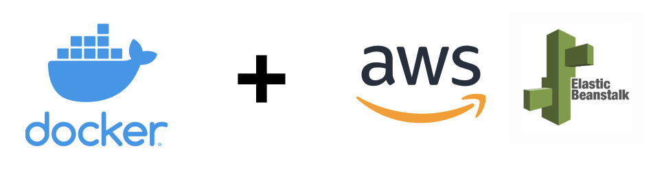

### 🚀 Projeto: Infraestrutura como Código com Docker e AWS

# 📋 Resumo do Projeto

Este é um projeto de Infraestrutura como Código (IaC) que utiliza Docker, Terraform para provisionamento e AWS como provedor de infraestrutura.

## 🔨 Funcionalidades do Projeto

Com este projeto, você pode:

- 🐳 Criar ambientes para aplicações Docker.
- 🔄 Separar seu código em dois ambientes: produção e homologação.
- 🚀 Configurar máquinas na AWS para executar um container com uma API em Django automaticamente.
- 🌱 Preparar uma infraestrutura elástica com Elastic Beanstalk.

## ✔️ Técnicas e Tecnologias Utilizadas

Este projeto explora:

- **Docker em EC2**: Automatização da criação de máquinas virtuais no EC2 para rodar containers Docker via Elastic Beanstalk.
- **Construção de Imagens Docker**: Criação e gerenciamento de imagens Docker.
- **AWS Elastic Container Registry (ECR)**: Utilização do repositório de containers da AWS para armazenar imagens Docker.
- **Terraform para IaC**: Uso do Terraform para construção automática e reutilização de código em ambientes separados.

## 📁 Acesso ao Projeto

- 📥 [Baixar o projeto (ZIP)](https://github.com/lucas-decastro/iac-docker-elastic-beanstalk-aws/archive/refs/heads/main.zip)
- 🔗 [Acessar o código fonte no GitHub](https://github.com/lucas-decastro/iac-docker-elastic-beanstalk-aws)

## 🛠️ Como Configurar e Rodar o Projeto

1. Instale o **Visual Studio Code (VSC)**. 
2. Na VSC, vá em extensões (Ctrl+Shift+X) e instale o **HashiCorp Terraform** para suporte ao intellisense.
3. Caso tenha baixado o ZIP, extraia-o antes de abrir.
4. Abra a pasta do projeto no VSC.
5. Abra um terminal (pode ser o integrado no VSC).
6. Navegue até `infra/`, `env/Prod` e `env/homolog`.
7. Execute `terraform init` em cada pasta.
8. Para criar a infraestrutura, execute `terraform apply` na pasta desejada (`env/Prod` ou `env/homolog`).
9. Atualize o ambiente AWS com:
   - Produção: `aws elasticbeanstalk update-environment --environment-name ambiente-de-producao --version-label ambiente-de-producao`
   - Homologação: `aws elasticbeanstalk update-environment --environment-name ambiente-de-homolog --version-label ambiente-de-homolog`